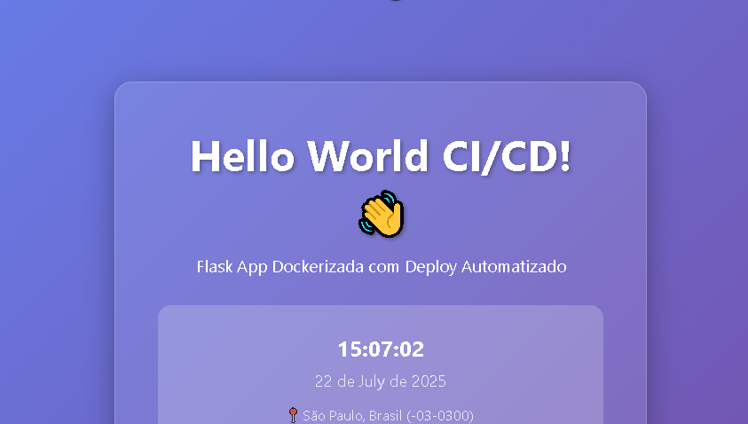

<!-- 
  Tags: DevOps
  Label: ⚙️ GCP/Heroku Docker - GitHub Actions.
  Description:⭐ Aplicação Flask Dockerizada com CI/CD Automatizado
  technical_requirement: Python, Dash, Plotly, pandas, gunicorn, Docker, Docker Compose, CSV, Power BI, Git, Vmlinuxd, MySQL, SSL, Bash Scripting, Debian 12, Hyper-V, WSL2, SSH, Java 21, Spring Boot, Spring WebFlux, Google Gemini API, Project Lombok, Jackson, Maven, Linux, Angular 17, Java 17, Nginx, REST API, Multi-stage builds, TypeScript, Node.js, Laravel, PHP 8.x, Cloud Run, Cloud SQL, Artifact Registry, GitHub Actions, CI/CD, Blade, Django, PostgreSQL, Django REST Framework, JWT, OAuth2, TDD, Agile, Scrum, Kanban, Flask, Heroku, NLP, JPA, SQL, SRE, IaC, Cloud Computing, GitHub, GitHub Actions
  path_hook: hookfigma.hook18
-->

# 🚀 Aplicação Flask Dockerizada com CI/CD - Google Cloud Run & Heroku

<div align="center">
  
  
    
  
  
  
   
</div>

## 📖 Sobre o Projeto

Este projeto implementa uma aplicação web moderna em Flask com frontend estiloso, empacotada em Docker e com pipelines de CI/CD totalmente automatizados usando GitHub Actions para deploy em **duas plataformas**:

- 🌐 **Google Cloud Run** - Escalabilidade serverless
- 🔥 **Heroku** - Simplicidade e rapidez

### ✨ Características:
- **Frontend Responsivo** com design glassmorphism e animações suaves
- **Deploy Automatizado** via GitHub Actions para ambas plataformas
- **Containerização** com Docker otimizado
- **Monitoramento** com health checks
- **Escalabilidade** automática
- **Multi-plataforma** - GCP e Heroku

---

## 🎯 Demonstração

A aplicação exibe:
- ✅ Mensagem "Hello World" estilizada
- 🕐 Hora atual em tempo real (São Paulo, Brasil)
- 📱 Interface responsiva para dispositivos móveis
- 🎨 Design moderno com efeitos visuais elegantes
- 🔍 Status do deploy e informações do sistema

---

## 🌐 Plataformas de Deploy Suportadas

| Plataforma | Branch | Workflow | Vantagens |
|------------|--------|----------|-----------|
| **🌐 Google Cloud Run** | `gcp-deploy` | `deploy-gcp.yml` | Escalabilidade serverless, tier gratuito generoso |
| **🔥 Heroku** | `heroku-deploy` | `deploy-heroku.yml` | Simplicidade, deploy rápido |

---

## 📁 Estrutura do Projeto

```
my-flask-app-docker/
├── app.py                         # 🐍 Aplicação Flask principal
├── requirements.txt               # 📦 Dependências Python
├── Dockerfile                     # 🐳 Configuração Docker
├── docker-compose.yml            # 🐳 Desenvolvimento local
├── README.md                     # 📖 Documentação
└── .github/
    └── workflows/
        ├── deploy-gcp.yml        # ⚙️ Pipeline CI/CD - Google Cloud
        └── deploy-heroku.yml     # ⚙️ Pipeline CI/CD - Heroku
```

---

## 🔧 Pré-requisitos

### Para Google Cloud Platform (GCP)
- ☁️ Conta Google Cloud ativa com billing habilitado
- 🔧 Projeto criado (anote o `PROJECT_ID`)

### Para Heroku
- 🔥 Conta Heroku (gratuita ou paga)
- 🔧 App Heroku criado
- 🔑 API Key do Heroku

### Para ambas plataformas
- 🐙 Repositório GitHub
- 💻 Docker Desktop (desenvolvimento local)
- 🐍 Python 3.9+ (desenvolvimento local)

---

# 🌐 CONFIGURAÇÃO GOOGLE CLOUD RUN

## 📋 Como Obter Variáveis do Google Cloud Platform

### 🔍 **Localizando Informações Essenciais do GCP**

#### **1️⃣ PROJECT_ID - ID do Projeto**

**Método 1: Console Web**
1. Acesse [Google Cloud Console](https://console.cloud.google.com)
2. No topo da página, clique no **seletor de projeto**
3. Na janela que abrir, você verá:
   - **Nome do Projeto**: Ex: "Meu App Flask"
   - **ID do Projeto**: Ex: `meu-projeto-flask-123456` ✅ **Esta é a variável!**

**Método 2: Cloud Shell/Terminal**
```bash
# Listar todos os projetos
gcloud projects list

# Ver projeto atual
gcloud config get-value project

# Definir projeto (se necessário)
gcloud config set project SEU_PROJECT_ID
```

**Método 3: URL do Console**
- Na URL do console: `https://console.cloud.google.com/home/dashboard?project=meu-projeto-123`
- O que vem após `project=` é seu PROJECT_ID ✅

#### **2️⃣ REGION - Região do Google Cloud**

**Regiões Mais Usadas no Brasil:**
```bash
# São Paulo (recomendada para BR)
southamerica-east1

# Outras opções próximas
us-east1        # Virgínia do Norte (boa latência)
us-central1     # Iowa (padrão em muitos tutoriais)
```

#### **3️⃣ SERVICE_ACCOUNT_EMAIL - Email da Conta de Serviço**

**Após criar a Service Account:**
```bash
# Listar todas as service accounts
gcloud iam service-accounts list

# Formato padrão será:
# github-actions-sa@SEU_PROJECT_ID.iam.gserviceaccount.com
```

#### **4️⃣ ARTIFACT_REGISTRY_URL - URL do Repositório**

**Formato padrão:**
```
REGION-docker.pkg.dev/PROJECT_ID/REPOSITORY_NAME
```

**Exemplo real:**
```
us-central1-docker.pkg.dev/meu-projeto-123/my-flask-app
```
## 📊 **Configuração GCP por Script para definição e Coleta de Variáveis**

Cole este script no **Google Cloud Shell** para obter todas as informações:

```bash
#!/bin/bash

echo "🔍 COLETANDO INFORMAÇÕES DO GCP..."
echo "=================================="

# Obter PROJECT_ID atual
PROJECT_ID=$(gcloud config get-value project)
echo "📌 PROJECT_ID: $PROJECT_ID"

# Obter região padrão (se configurada)
REGION=$(gcloud config get-value compute/region 2>/dev/null)
if [ -z "$REGION" ]; then
    REGION="us-central1"  # Padrão
fi
echo "🌍 REGION: $REGION"

# Definir nomes padrão
SERVICE_ACCOUNT_NAME="github-actions-sa"
REPOSITORY_NAME="my-flask-app"
SERVICE_NAME="my-flask-app"

echo "👤 SERVICE_ACCOUNT_EMAIL: $SERVICE_ACCOUNT_NAME@$PROJECT_ID.iam.gserviceaccount.com"
echo "📦 ARTIFACT_REGISTRY_URL: $REGION-docker.pkg.dev/$PROJECT_ID/$REPOSITORY_NAME"
echo "🐳 REPOSITORY_NAME: $REPOSITORY_NAME"
echo "🚀 SERVICE_NAME: $SERVICE_NAME"

echo ""
echo "=================================="
echo "✅ INFORMAÇÕES COLETADAS COM SUCESSO!"
echo ""
echo "📝 PRÓXIMOS PASSOS:"
echo "1. Use PROJECT_ID como GitHub Secret: GCP_PROJECT_ID"
echo "2. Use as outras variáveis no arquivo .github/workflows/deploy.yml"
echo "=================================="
```
### 📊 **Forma manual para definição Google Cloud Shell**
```bash

🌱 Definir variáveis (SUBSTITUA SEU_PROJECT_ID)
export PROJECT_ID="SEU_PROJECT_ID_AQUI"
export SERVICE_ACCOUNT_NAME="github-actions-sa"
export REGION="us-central1"
export REPOSITORY_NAME="my-flask-app"
echo "Projeto atual: $(gcloud config get-value project)"

```
---

## ⚡ Configuração Rápida GCP

### 1️⃣ **Configurar GCP (Cloud Shell)**

```bash

# 🔧 Listar projetos disponíveis e identificar projeto ativo
gcloud projects list
gcloud config get-value project

# ✅ Configurar projeto
gcloud config set project $PROJECT_ID

# 🔧 Verificar APIs habilitadas
gcloud services list \
  --enabled \
  --filter="name:(run.googleapis.com OR artifactregistry.googleapis.com)" \
  --format="value(name)"

# ✅ Habilitar APIs necessárias
gcloud services enable run.googleapis.com \
  artifactregistry.googleapis.com \
  iam.googleapis.com \
  cloudbuild.googleapis.com

# 🔧 Verificar Repositório Artifact Registry existe
gcloud artifacts repositories list --format="table(name,location)"

# ✅ Criar repositório Artifact Registry
gcloud artifacts repositories create $REPOSITORY_NAME \
  --repository-format=docker \
  --location=$REGION \
  --description="Repositório Docker para $REPOSITORY_NAME"

# 🔧 Verificar todas Service Accounts que exitem
gcloud iam service-accounts list

🔧 Verificar Service Account existe
gcloud iam service-accounts list --filter="email:github-actions-sa@*"

# ✅ Criar Service Account
gcloud iam service-accounts create $SERVICE_ACCOUNT_NAME \
  --display-name="Service Account para GitHub Actions"

# 🔧 Verificar Permissões da Service Account
gcloud projects get-iam-policy $(gcloud config get-value project) \
  --flatten="bindings[].members" \
  --filter="bindings.members:serviceAccount:github-actions-sa@*" \
  --format="table(bindings.role)"

# ✅ Conceder permissões
gcloud projects add-iam-policy-binding $PROJECT_ID \
  --member="serviceAccount:$SERVICE_ACCOUNT_NAME@$PROJECT_ID.iam.gserviceaccount.com" \
  --role="roles/run.admin"

gcloud projects add-iam-policy-binding $PROJECT_ID \
  --member="serviceAccount:$SERVICE_ACCOUNT_NAME@$PROJECT_ID.iam.gserviceaccount.com" \
  --role="roles/artifactregistry.writer"

gcloud projects add-iam-policy-binding $PROJECT_ID \
  --member="serviceAccount:$SERVICE_ACCOUNT_NAME@$PROJECT_ID.iam.gserviceaccount.com" \
  --role="roles/iam.serviceAccountUser"

# ✅ Gerar chave da Service Account
gcloud iam service-accounts keys create sa-key.json \
  --iam-account="$SERVICE_ACCOUNT_NAME@$PROJECT_ID.iam.gserviceaccount.com"

# ✅ Exibir conteúdo para copiar
echo "=== COPIE TODO O CONTEÚDO ABAIXO ==="
cat sa-key.json
```

### 2️⃣ **Configurar GitHub Secrets para GCP**

No seu repositório GitHub:

1. **Settings** → **Secrets and variables** → **Actions**
2. **New repository secret** e crie:

```
# 🔑 **Secrets 1 para GCP:**
Name: GCP_SA_KEY
Value: [Cole todo o JSON do arquivo sa-key.json aqui]

# 🆔 **Secret 2:**
Name: GCP_PROJECT_ID  
Value: [Seu PROJECT_ID do GCP]
```

---

# 🔥 CONFIGURAÇÃO HEROKU

## 📋 Como Obter Variáveis do Heroku

### 1️⃣ **Criar Conta e App no Heroku**

1. Acesse [Heroku](https://www.heroku.com) e crie uma conta
2. No Dashboard, clique em **"New"** → **"Create new app"**
3. Escolha um nome único para seu app (ex: `meu-flask-app-123`)
4. Selecione uma região (preferencialmente **United States**)
5. Clique em **"Create app"**

### 2️⃣ **Obter API Key do Heroku**

**Método 1: Dashboard Web**
1. No Heroku Dashboard, clique no seu **avatar** (canto superior direito)
2. Clique em **"Account settings"**
3. Na seção **"API Key"**, clique em **"Reveal"**
4. Copie a chave exibida ✅

**Método 2: Heroku CLI**
```bash
# Instalar Heroku CLI (se necessário)
# No Windows: https://devcenter.heroku.com/articles/heroku-cli
# No Mac: brew tap heroku/brew && brew install heroku
# No Ubuntu: sudo snap install --classic heroku

# Fazer login
heroku login

# Exibir API key
heroku auth:token
```

### 3️⃣ **Configurar GitHub Secrets para Heroku**

No seu repositório GitHub:

1. **Settings** → **Secrets and variables** → **Actions**
2. **New repository secret** e crie:

#### 🔑 **Secrets para Heroku:**
```
Name: HEROKU_API_KEY
Value: [Sua API Key do Heroku]

Name: HEROKU_APP_NAME  
Value: [Nome do seu app no Heroku - ex: meu-flask-app-123]
```

---

## 🚀 Deploy Automático

### Para Google Cloud Run:
```bash
# Clone seu repositório
git clone <URL_DO_SEU_REPOSITORIO>
cd my-flask-app-docker

# Adicione os arquivos do projeto
git add .
git commit -m "🚀 Initial deploy to GCP Cloud Run"

# Push para branch específica do GCP
git checkout -b gcp-deploy
git push origin gcp-deploy
```

### Para Heroku:
```bash
# No mesmo repositório
git checkout -b heroku-deploy
git push origin heroku-deploy
```

🎉 **Pronto!** Os GitHub Actions serão executados automaticamente para cada plataforma.

---

## 🔄 Workflows e Branches

### 🌐 **Google Cloud Run Workflow**
- **Branch**: `gcp-deploy`
- **Arquivo**: `.github/workflows/deploy-gcp.yml`
- **Trigger**: Push ou PR para `gcp-deploy`

### 🔥 **Heroku Workflow**
- **Branch**: `heroku-deploy` 
- **Arquivo**: `.github/workflows/deploy-heroku.yml`
- **Trigger**: Push ou PR para `heroku-deploy`

### 🔄 **Fluxo de Desenvolvimento Recomendado**

```bash
# Desenvolvimento na branch main
git checkout main
# ... fazer alterações ...
git add .
git commit -m "✨ Nova funcionalidade"

# Deploy para Heroku (mais rápido para testes)
git checkout heroku-deploy
git merge main
git push origin heroku-deploy

# Deploy para GCP (após validação)
git checkout gcp-deploy  
git merge main
git push origin gcp-deploy
```

---

## 🔍 Verificação dos Deploys

### 🌐 **Google Cloud Run**
```bash
# Via Command Line
gcloud run services list --region=us-central1

# Via Console
# https://console.cloud.google.com/run
```

### 🔥 **Heroku**
```bash
# Via Heroku CLI
heroku apps:info -a SEU_APP_NAME

# Via Dashboard
# https://dashboard.heroku.com/apps/SEU_APP_NAME
```

---

## 📊 Comparação de Plataformas

| Aspecto | Google Cloud Run | Heroku |
|---------|------------------|--------|
| **🚀 Facilidade** | Moderada | Alta |
| **💰 Custo Inicial** | Gratuito (tier generoso) | Gratuito limitado |
| **📈 Escalabilidade** | Excelente (0-1000+ instâncias) | Boa |
| **⚡ Cold Start** | ~1-3 segundos | ~10-30 segundos |
| **🔧 Configuração** | Mais complexa | Simples |
| **🌍 Regiões** | Mundial | Limitada |
| **📊 Monitoramento** | Avançado (Cloud Monitoring) | Básico |
| **💾 Persistência** | Externa (Cloud Storage) | Add-ons |

---

## 💰 Custos e Limites

### 🌐 **Google Cloud Run (Tier Gratuito)**
- ✅ **2 milhões** de requisições/mês
- ✅ **180.000** vCPU-segundos/mês  
- ✅ **360.000** GiB-segundos de memória/mês
- ✅ **1 GB** de largura de banda/mês
- 🎁 **$300** em créditos para novos usuários

### 🔥 **Heroku (Planos)**
- 🆓 **Free Tier**: Não disponível para novos apps
- 💵 **Eco Dyno**: $5/mês (dorme após 30 min de inatividade)
- 💰 **Basic Dyno**: $7/mês (não dorme)
- 🚀 **Standard**: $25/mês (recursos avançados)

---

## 🖥️ Desenvolvimento Local

### Executar com Python:
```bash
# Criar ambiente virtual
python -m venv venv
source venv/bin/activate  # Windows: venv\Scripts\activate

# Instalar dependências
pip install -r requirements.txt

# Executar aplicação
python app.py
```

### Executar com Docker:
```bash
# Build da imagem
docker build -t my-flask-app .

# Executar container
docker run -p 5000:5000 -e PORT=5000 my-flask-app
```

### Executar com Docker Compose:
```bash
# Iniciar todos os serviços
docker-compose up

# Executar em background
docker-compose up -d

# Parar serviços
docker-compose down
```

Acesse: `http://localhost:5000`

---

## 📋 Variáveis do Projeto

### 🌐 **Google Cloud Run**
| Variável | Tipo | Onde Configurar | Exemplo |
|----------|------|-----------------|---------|
| `GCP_SA_KEY` | GitHub Secret | Repo Settings | `{json completo}` |
| `GCP_PROJECT_ID` | GitHub Secret | Repo Settings | `meu-projeto-123` |
| `REGION` | Workflow | `deploy-gcp.yml` | `us-central1` |
| `SERVICE_NAME` | Workflow | `deploy-gcp.yml` | `my-flask-app` |

### 🔥 **Heroku**
| Variável | Tipo | Onde Configurar | Exemplo |
|----------|------|-----------------|---------|
| `HEROKU_API_KEY` | GitHub Secret | Repo Settings | `abc123...` |
| `HEROKU_APP_NAME` | GitHub Secret | Repo Settings | `meu-flask-app-123` |

---

## 🔧 Resolução de Problemas

### ❌ **Erros Comuns - Google Cloud**

**"Permission Denied"**
```bash
# Verificar permissões da service account
gcloud projects get-iam-policy $PROJECT_ID \
  --filter="bindings.members:serviceAccount:github-actions-sa@$PROJECT_ID.iam.gserviceaccount.com"
```

**"Repository Not Found"**
```bash
# Verificar se repositório existe
gcloud artifacts repositories list --location=us-central1
```

**"API Not Enabled"**
```bash
# Verificar APIs habilitadas
gcloud services list --enabled --filter="name:(run.googleapis.com OR artifactregistry.googleapis.com)"
```

### ❌ **Erros Comuns - Heroku**

**"Invalid credentials"**
- Verifique se o `HEROKU_API_KEY` está correto
- Gere uma nova API Key se necessário

**"App not found"**
- Verifique se o `HEROKU_APP_NAME` está correto
- Confirme se o app existe no Dashboard do Heroku

**"Build failed"**
- Verifique os logs no GitHub Actions
- Teste o build localmente: `docker build -t test .`

**"Release failed"**
```bash
# Verificar logs do Heroku
heroku logs --tail -a SEU_APP_NAME
```

### 🔄 **Problemas de Sincronização entre Branches**

```bash
# Sincronizar branches após alterações
git checkout main
git pull origin main

# Atualizar branch do Heroku
git checkout heroku-deploy
git merge main
git push origin heroku-deploy

# Atualizar branch do GCP
git checkout gcp-deploy
git merge main
git push origin gcp-deploy
```

---

## 🧹 Limpeza de Recursos

### 🌐 **Google Cloud**
```bash
# Deletar serviço Cloud Run
gcloud run services delete my-flask-app --region=us-central1

# Deletar repositório Artifact Registry  
gcloud artifacts repositories delete my-flask-app --location=us-central1

# Deletar service account
gcloud iam service-accounts delete github-actions-sa@$PROJECT_ID.iam.gserviceaccount.com
```

### 🔥 **Heroku**
```bash
# Via CLI
heroku apps:destroy SEU_APP_NAME

# Via Dashboard
# Apps → Settings → Delete app
```

---

## 📚 Documentação e Recursos

### 🌐 **Google Cloud**
- 📖 [Cloud Run Documentation](https://cloud.google.com/run/docs)
- 💬 [Google Cloud Community](https://cloud.google.com/community)
- 🔧 [GitHub Actions for Google Cloud](https://github.com/google-github-actions)

### 🔥 **Heroku**
- 📖 [Heroku Dev Center](https://devcenter.heroku.com/)
- 🐳 [Container Registry & Runtime](https://devcenter.heroku.com/articles/container-registry-and-runtime)
- 🔧 [Heroku CLI](https://devcenter.heroku.com/articles/heroku-cli)

### 🐙 **GitHub Actions**
- 📖 [GitHub Actions Documentation](https://docs.github.com/en/actions)
- 🔐 [Encrypted Secrets](https://docs.github.com/en/actions/security-guides/encrypted-secrets)

---

## 🤝 Contribuições

Contribuições são bem-vindas! Para contribuir:

1. Fork o projeto
2. Crie uma branch: `git checkout -b feature/nova-funcionalidade`
3. Commit: `git commit -m "✨ Adiciona nova funcionalidade"`
4. Push: `git push origin feature/nova-funcionalidade`
5. Abra um Pull Request

---

## 📄 Licença

Este projeto está sob licença MIT. Veja o arquivo [LICENSE](LICENSE) para detalhes.

---

## 🆘 Suporte

### Problemas Comuns:
- 📖 Consulte a seção "Resolução de Problemas"
- 🔍 Veja os logs no GitHub Actions
- 📊 Monitore nos consoles das respectivas plataformas

### Precisa de Ajuda?
- 🐛 Abra uma [Issue](../../issues)
- 💬 Inicie uma [Discussion](../../discussions)
- 📧 Entre em contato através do GitHub

---

**🎉 Projeto criado com Flask + Docker + GitHub Actions + Google Cloud Run + Heroku**

---

## 🚀 Quick Start

### Para começar rapidamente:

1. **Clone o repositório**
2. **Escolha sua plataforma preferida** (GCP ou Heroku)
3. **Configure os secrets** correspondentes no GitHub
4. **Faça push** para a branch correta:
   - `gcp-deploy` para Google Cloud Run
   - `heroku-deploy` para Heroku
5. **Acompanhe o deploy** nas Actions do GitHub

✨ **Tip**: Para máxima compatibilidade, teste primeiro no Heroku (mais simples) e depois migre para GCP (mais escalável).

## 👨‍💻 Autor

[Fabiano Rocha/Fabiuniz]